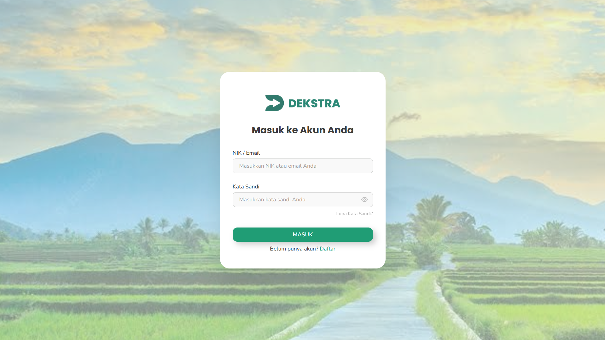
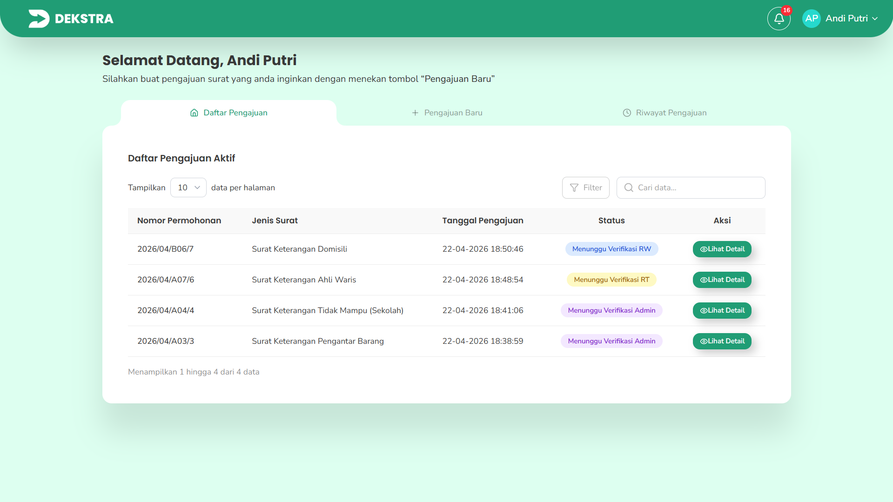
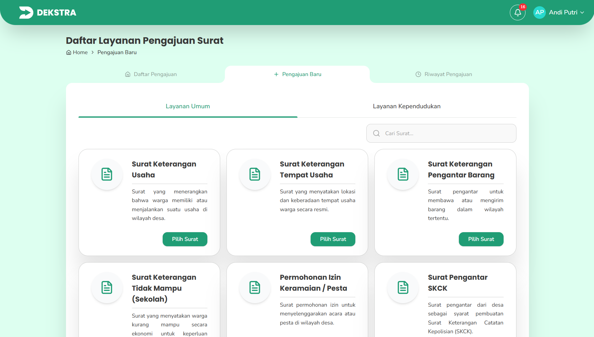
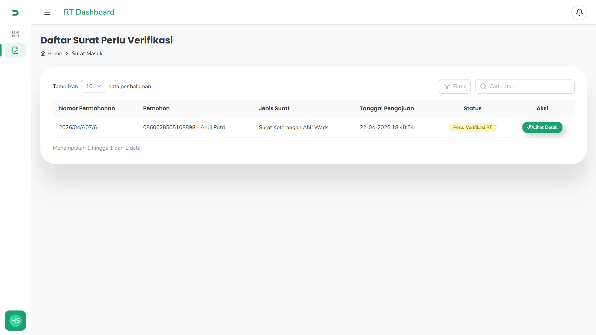
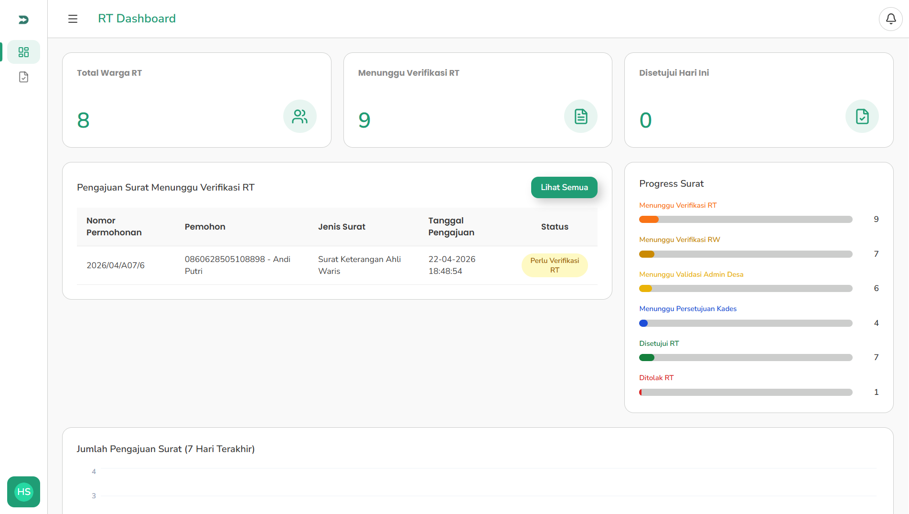

# DEKSTRA — Digitalisasi Administrasi Desa

<div align="center">



<br />
<br />


<br />
<br />

Platform digital administrasi desa untuk pengajuan surat, verifikasi berjenjang, dan manajemen layanan kependudukan secara modern dan terintegrasi.

</div>

---

# Table of Contents

- [Introduction](#-introduction)
- [Tech Stack](#-tech-stack)
- [Features](#-features)
- [Quick Start](#-quick-start)
- [Screenshots](#-screenshots)
- [Deployment](#-deployment)
- [Useful Links](#-useful-links)

---

# Introduction

DEKSTRA adalah aplikasi berbasis web yang dirancang untuk membantu digitalisasi pelayanan administrasi desa secara modern, cepat, dan terstruktur.

Aplikasi ini mendukung:
- Pengajuan surat online oleh warga
- Verifikasi berjenjang (RT → RW → Admin → Kepala Desa)
- Monitoring status pengajuan secara realtime
- Manajemen data surat dan dokumen
- Sistem autentikasi multi-role
- Dashboard administrasi interaktif

---

# Tech Stack

## Frontend
- Next.js 16 (App Router)
- React 19
- TypeScript
- Tailwind CSS

## State Management & Data Fetching
- TanStack Query
- React Hook Form
- Zod Validation

## UI & Utilities
- Lucide React
- clsx
- date-fns

## Backend Integration
- REST API
- Cookie-based Authentication

---

# Features

## Authentication
- Login & Register
- OTP Verification
- Protected Routes
- Role-based Access Control

## Surat & Administrasi
- Pengajuan surat online
- Dynamic form generator
- Upload persyaratan
- Multi-step form validation

## Workflow Verifikasi
- Verifikasi RT
- Verifikasi RW
- Verifikasi Admin
- Persetujuan Kepala Desa

## Dashboard
- Statistik pengajuan
- Monitoring status surat
- Riwayat pengajuan warga
- Filter & pencarian data

## Security
- Middleware route protection
- API route protection
- Role-based authorization

---

# Quick Start

Ikuti langkah berikut untuk menjalankan project DEKSTRA secara lokal.

## 1. Clone Repository

```bash
git clone https://github.com/username/dekstra-web.git
```

## 2. Masuk ke Folder Project

```bash
cd dekstra-web
```

## 3. Install Dependencies

Menggunakan npm:

```bash
npm install
```

atau menggunakan yarn:

```bash
yarn install
```

## 4. Setup Environment Variables

Buat file `.env.local` di root project.

```env
NEXT_PUBLIC_API_URL=http://localhost:8000
```

Tambahkan environment variable lain sesuai kebutuhan backend Anda.

## 5. Jalankan Development Server

```bash
npm run dev
```

Buka browser dan akses:

```txt
http://localhost:3000
```

---

# Screenshots

## Dashboard Warga

<p align="center">
  
</p>

---

## Daftar Layanan Surat

<p align="center">
  
</p>

---

## Verifikasi Pengajuan

<p align="center">
  
</p>

---

## Dashboard RT

<p align="center">
  
</p>

---

# Deployment

Project DEKSTRA dapat dideploy menggunakan berbagai platform modern seperti:

- Vercel
- Netlify
- Railway
- VPS / Docker

## Build Production

```bash
npm run build
```

## Menjalankan Production Server

```bash
npm run start
```

## Linting

```bash
npm run lint
```

---

# Useful Links

## Official Documentation

- Next.js  
  https://nextjs.org/docs

- React  
  https://react.dev

- TypeScript  
  https://www.typescriptlang.org

- Tailwind CSS  
  https://tailwindcss.com

- TanStack Query  
  https://tanstack.com/query/latest

- React Hook Form  
  https://react-hook-form.com

- Zod  
  https://zod.dev

---

## Additional Resources

- Vercel Deployment Guide  
  https://nextjs.org/docs/app/building-your-application/deploying

- Lucide Icons  
  https://lucide.dev

- date-fns  
  https://date-fns.org

---

<p align="center">
  Built with ❤️ by Kelompok 06 Capstone Siklus II Tahun 2025 Teknik Komputer Universitas Diponegoro using Next.js, TypeScript, and Tailwind CSS
</p>